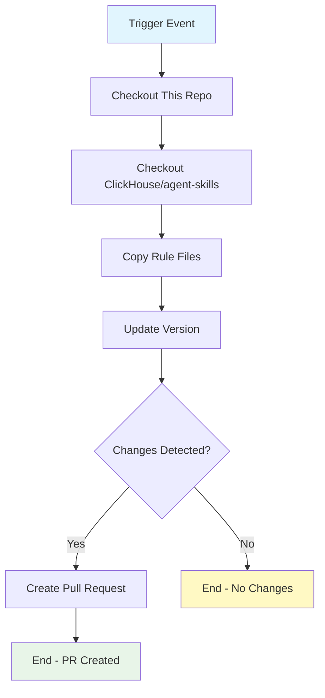

## Workflow Overview

**Purpose**: Automatically synchronize ClickHouse best practice rule files from the official ClickHouse/agent-skills repository to maintain rule currency.
**Trigger Events**: Manual workflow dispatch, Weekly schedule (Sunday 00:00 UTC)
**Target Environments**: Source code repository (rules directory only)

## Execution Flow Diagram



## Jobs & Dependencies

| Job Name | Purpose | Dependencies | Execution Context |
|----------|---------|--------------|-------------------|
| sync-rules | Sync upstream rules to local | None | ubuntu-latest |

## Requirements Matrix

### Functional Requirements

| ID | Requirement | Priority | Acceptance Criteria |
|----|-------------|----------|-------------------|
| REQ-001 | Fetch latest ClickHouse/agent-skills | High | Successful git clone from upstream |
| REQ-002 | Copy rule files to skills/clickhouse/rules/ | High | All 28 rule files copied without errors |
| REQ-003 | Auto-increment version number | Medium | SKILL.md and plugin.json versions incremented |
| REQ-004 | Create PR on changes | High | PR created only when actual changes detected |
| REQ-005 | Preserve custom content | Critical | references/ directory never modified |

### Security Requirements

| ID | Requirement | Implementation Constraint |
|----|-------------|---------------------------|
| SEC-001 | Token permissions | Minimal: contents:write, pull-requests:write |
| SEC-002 | Upstream verification | Clone only from official ClickHouse/agent-skills repo |
| SEC-003 | Branch isolation | Use dedicated branch, auto-delete after merge |

### Performance Requirements

| ID | Metric | Target | Measurement Method |
|----|-------|--------|-------------------|
| PERF-001 | Execution time | < 5 minutes | GitHub Actions timing |
| PERF-002 | PR creation latency | < 30 seconds after sync | PR creation timestamp |

## Input/Output Contracts

### Inputs

```yaml
# Workflow Dispatch Inputs
# (None currently - could add branch, upstream ref options)

# Schedule Trigger
cron: '0 0 * * 0'  # Weekly Sunday midnight UTC

# Repository Context
default_branch: main
upstream_repo: ClickHouse/agent-skills
upstream_ref: main
```

### Outputs

```yaml
# Job Outputs
has_changes: boolean  # Whether changes were detected
new_version: string   # Updated version number if changed
pr_number: integer    # Created PR number (if applicable)
```

### Secrets & Variables

| Type | Name | Purpose | Scope |
|------|------|---------|-------|
| Token | GITHUB_TOKEN | PR creation, commits | Workflow |
| Variable | RULES_DIR | Target directory path | Repository |
| Variable | UPSTREAM_REPO | Source repository | Repository |

## Execution Constraints

### Runtime Constraints

- **Timeout**: 10 minutes maximum
- **Concurrency**: Single workflow instance at a time
- **Resource Limits**: Standard ubuntu-latest (2-core, 7GB RAM)

### Environmental Constraints

- **Runner Requirements**: ubuntu-latest with git, coreutils
- **Network Access**: github.com (read/write), api.github.com
- **Permissions**: contents:write, pull-requests:write

## Error Handling Strategy

| Error Type | Response | Recovery Action |
|------------|----------|-----------------|
| Upstream clone failure | Fail workflow | Check network, repo availability |
| Version parse failure | Fail workflow | Manual version update required |
| No changes detected | Exit success | No PR created, workflow ends cleanly |
| PR creation failure | Fail workflow | Check token permissions, branch conflicts |

## Quality Gates

### Gate Definitions

| Gate | Criteria | Bypass Conditions |
|------|----------|-------------------|
| Upstream availability | Repo reachable, ref exists | None - critical path |
| Rule file validity | Files contain expected frontmatter | Review required if malformed |
| Version format | Semantic version (X.Y.Z) | None - automated increment |

## Monitoring & Observability

### Key Metrics

- **Success Rate**: Target 95%+ (upstream deps)
- **Execution Time**: Target < 5 minutes
- **PR Merge Rate**: Track how often sync PRs are merged

### Alerting

| Condition | Severity | Notification Target |
|-----------|----------|-------------------|
| 3+ consecutive failures | High | Repository maintainers |
| Upstream repo unavailable | Critical | Immediate notification |
| Version increment failure | Medium | Review required |

## Integration Points

### External Systems

| System | Integration Type | Data Exchange | SLA Requirements |
|--------|------------------|---------------|------------------|
| ClickHouse/agent-skills | Git clone (read-only) | Rule files (Markdown) | Best-effort, retry on failure |
| GitHub API | REST API (write) | Pull requests | GitHub platform SLA |

### Dependent Workflows

| Workflow | Relationship | Trigger Mechanism |
|----------|--------------|-------------------|
| None | Independent | Manual/schedule only |

## Compliance & Governance

### Audit Requirements

- **Execution Logs**: Retained 90 days per GitHub default
- **Approval Gates**: Manual review required for sync PRs
- **Change Control**: PR workflow enforces review before merge

### Security Controls

- **Access Control**: Repository maintainers approve workflow changes
- **Secret Management**: GitHub Actions token (auto-provisioned)
- **Vulnerability Scanning**: Third-party actions pinned to version

## Edge Cases & Exceptions

### Scenario Matrix

| Scenario | Expected Behavior | Validation Method |
|----------|-------------------|-------------------|
| Upstream rule deleted | Local file preserved | Manual review required |
| Version format changes | Parse failure → workflow fails | Check version string format |
| Conflicting branch exists | PR creation may fail | Force-push or branch rename |
| No upstream changes | Exit cleanly, no PR | Check git diff output |

## Validation Criteria

### Workflow Validation

- **VLD-001**: All 28 rule files copied
- **VLD-002**: Version incremented in both SKILL.md and plugin.json
- **VLD-003**: references/ directory unchanged
- **VLD-004**: PR created only with actual changes

### Performance Benchmarks

- **PERF-001**: Complete execution < 5 minutes
- **PERF-002**: PR creation < 30 seconds from workflow start

## Change Management

### Update Process

1. **Specification Update**: Modify this document first
2. **Review & Approval**: Create PR for spec changes
3. **Implementation**: Apply changes to sync-rules.yml
4. **Testing**: Manually trigger workflow to validate
5. **Deployment**: Merge to main branch

### Version History

| Version | Date | Changes | Author |
|---------|------|---------|--------|
| 1.0 | 2025-03-13 | Initial specification | duyetbot |

## Related Specifications

- [ClickHouse/agent-skills Repository](https://github.com/ClickHouse/agent-skills)
- [GitHub Actions Documentation](https://docs.github.com/en/actions)
- [Claude Plugins Documentation](../README.md)

## Appendix: Rule File Mapping

| Rule Category | Count | File Pattern |
|---------------|-------|--------------|
| Primary Key | 4 | schema-pk-*.md |
| Data Types | 5 | schema-types-*.md |
| Partitioning | 4 | schema-partition-*.md |
| JSON | 1 | schema-json-*.md |
| JOIN | 5 | query-join-*.md |
| Materialized Views | 2 | query-mv-*.md |
| Indexing | 1 | query-index-*.md |
| Batching | 1 | insert-batch-*.md |
| Async | 2 | insert-async-*.md |
| Mutation | 2 | insert-mutation-*.md |
| Optimization | 1 | insert-optimize-*.md |
| **Total** | **28** | - |
